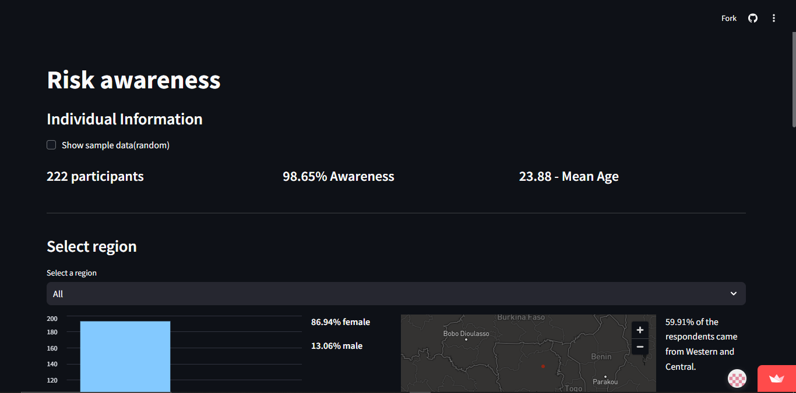
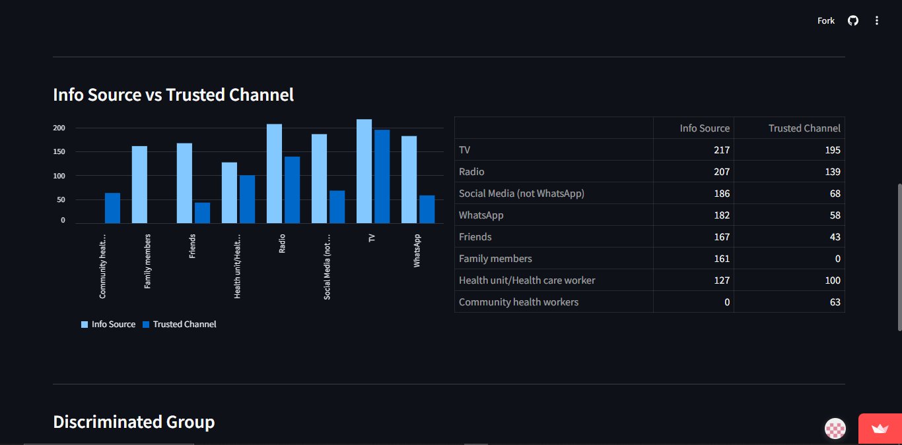
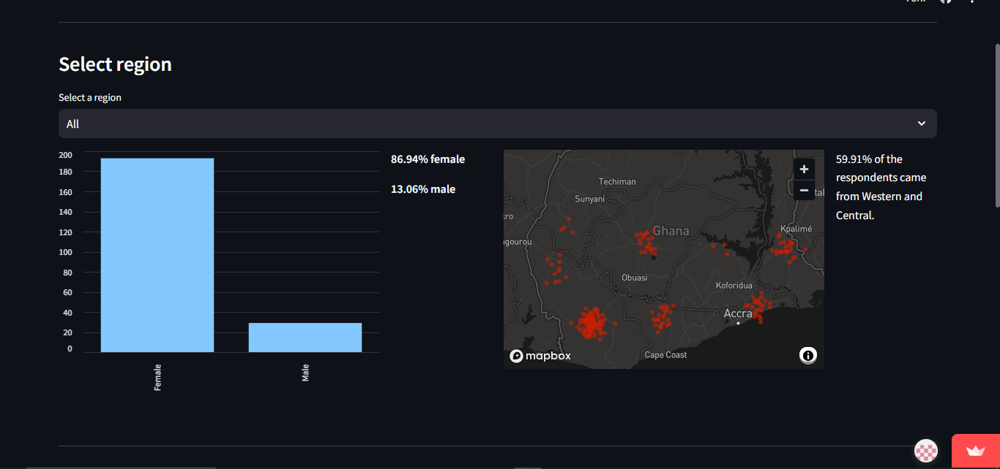

# Risk Awareness Infogram

This project is a Streamlit-based infogram designed to visualize and analyze survey data collected from a university in Ghana. The survey was conducted during the COVID-19 pandemic to investigate students' risk awareness and related behaviors.
Check final infograph at https://risk-awareness-cv.streamlit.app/

Screenshots:

## Features

1. **Dataset Integration**:  
   Prior to this, the survey data was cleaned and normalized to produce multiple datasets(check data folder). In this project, these datasets are integrated, including individual information, information sources, trusted channels, and discriminated groups. 

2. **Interactive Visualizations**:  
   - **Data Sampling**: Display random samples of individual information.  
   - **Demographic Insights**: Breakdown of participants' demographics, including gender distribution and regional representation.  
   - **Visualization Tools**: 
     - Bar charts for gender counts, information source analysis, and trusted channels.
     - A dynamic map visualization of participant locations by region.

3. **User Interaction**:  
   - **Region Selection**: Users can filter insights by specific regions or view aggregated data across all regions.
   - **Data Exploration**: Checkboxes, select boxes, and column layouts allow for an intuitive exploration of data.

4. **Cross-Dataset Correlation**:  
   - A comparative visualization of information sources versus trusted channels, highlighting discrepancies and overlaps in respondents' preferences.
   - Identification of the most discriminated groups reported during the pandemic.

## Technical Details

- **Framework**: Built using [Streamlit](https://streamlit.io/) for rapid web-based visualization and interaction.
- **Libraries**: Utilizes `pandas` for data manipulation and `numpy` for random data generation. 
- **Caching**: Implements efficient caching with `@st.cache_data` to optimize performance while loading datasets.

An interactive platform for analyzing the impact and behavioral insights from the survey data, tailored for decision-makers and researchers. :)
